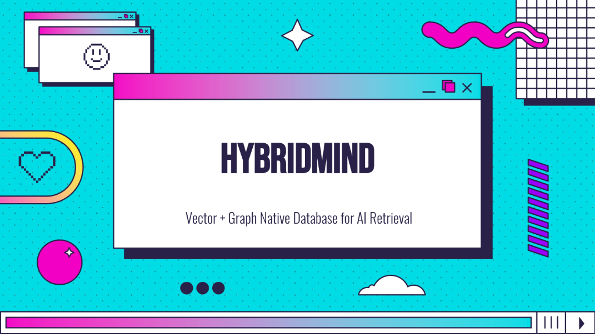

<p align="center">
  
</p>

<p align="center">
  <strong>local dense, sparse, and graph retrieval for AI memory experiments.</strong>
</p>

<p align="center">
  <a href="#quick-start"></a>
  <a href="#how-its-built"></a>
  <a href="tests/"></a>
  <a href="AGENTS.md"></a>
</p>

---

most memory systems for AI agents can't answer a simple question: why did you pull that? they hand back a few chunks and a similarity score and ask you to trust them.

HybridMind is my attempt at the opposite. it's a local retrieval service that searches three ways at once (dense vectors, BM25 keywords, and a typed graph), fuses the results, and keeps enough receipts to show what it retrieved, why, and whether that evidence actually helped the answer.

the bet is that inspectable retrieval grounds an agent better than pouring raw tokens into a huge context window and hoping. it's a bet, not a result. HybridMind is not a KV-cache replacement, and it has not proven it can stand in for a 10M–100M-token context. that's a research target with preregistered gates, and the honest status lives in [PHASE_IMPLEMENTATION_STATUS.md](PHASE_IMPLEMENTATION_STATUS.md).

## what's inside

| area | what it does |
|---|---|
| retrieval | FAISS HNSW dense search, Okapi BM25 (`bm25s` + PyStemmer), and a typed NetworkX directed multigraph |
| ranking | time-aware weighted reciprocal-rank fusion (`k=60`), with each retrieval path switchable on its own |
| evidence | corpus/session scoping and exact evidence IDs for retrieval metrics |
| persistence | SQLite in WAL mode is the source of truth; every index is rebuilt from it |
| portability | checksummed `.mind.zip` snapshots in JSON/JSONL, never executable pickles |
| embeddings | remote native embeddings only, validated to exactly 4096 dimensions |

## why three paths

vector search is good at meaning and bad at exact terms. it'll miss the one ticket number or function name you actually asked about. keyword search has the reverse problem. a graph catches explicit relations, like "this fact replaced that one", but gets brittle when it's sparse or noisy.

so HybridMind keeps them as separate candidate paths and fuses them at the end. the point isn't that fusion is magic. it's that you can turn each path off, measure what it contributed, and stop guessing.

```
                        ┌──────────────┐
                        │  user query  │
                        └──────┬───────┘
          ┌────────────────────┼────────────────────┐
          ▼                    ▼                    ▼
 ┌─────────────────┐  ┌─────────────────┐  ┌─────────────────┐
 │   FAISS HNSW    │  │      BM25S      │  │ NetworkX graph  │
 │  dense vectors  │  │ sparse keywords │  │ entities, links │
 └────────┬────────┘  └────────┬────────┘  └────────┬────────┘
          └────────────────────┼────────────────────┘
                               ▼
                ┌──────────────────────────────┐
                │ reciprocal rank fusion, k=60 │
                │    + temporal scoping        │
                └──────────────┬───────────────┘
                               ▼
                ┌──────────────────────────────┐
                │ evidence set with stable IDs │
                └──────────────────────────────┘
```

## how it's built

- **fusion.** reciprocal-rank fusion with $k=60$ blends dense ranks, BM25 ranks, graph proximity, and time relevance pulled from the query. `search_mode` (`vector_only`, `sparse_only`, `vector_sparse`, `graph_only`, `hybrid`) makes ablations real code paths, not weight tweaks.
- **tri-signal retrieval (`POST /retrieve`).** three independent channels rank each scope: exact dense search over native 4096-d vectors, BM25S, and an entity–memory graph ported from EMG (exact parity with upstream on its LoCoMo artifacts) with query-derived anchors and optional HippoRAG-2 personalized PageRank. results are fused (RRF k=60, DBSF, or z-score), optionally reranked inside a fixed pool, and packed into a token-budgeted evidence set with stable IDs. see [docs/REPRODUCTION_MAP.md](docs/REPRODUCTION_MAP.md).
- **reranking, optional.** when it's enabled, `BAAI/bge-reranker-v2-m3` (local, or through a TEI `/rerank` endpoint) reranks a bounded pool. responses say whether it actually ran.
- **query decomposition, optional.** `engine/query_decomposition.py` can split a multi-step question into two or three sub-questions. it rejects invented entities, duplicates, and dropped time qualifiers. whether it helps is still an open question.
- **the 4096 rule.** the embedding endpoint (TEI or OpenAI-compatible) must return exactly 4096 finite values. anything else fails at startup, ingestion, or insert. there is no local, padded, or projected fallback, on purpose.
- **structured facts.** a fact can carry entities, event time, validity, a memory kind (world, experience, observation, opinion), confidence, and supersession. these only get credit when the retrieval path actually reads them.
- **salience and summaries, optional.** salience is a recency/access/degree multiplier. consolidation writes lossy summaries linked back to their sources. it never replaces the source facts.

a live `.mind` directory holds:

- `store.db`, the SQLite database for nodes, edges, sessions, and metadata
- `vectors.json`, `graph.jsonl`, `bm25.jsonl`, the derived index data
- `manifest.json`, with SHA-256 checksums and backup rotation
- in-memory FAISS, NetworkX, and BM25 indexes rebuilt from all of the above

## a few rules i hold it to

- fail closed on malformed provider output, corrupt files, partial batches, and bad benchmark provenance.
- indexes are projections. SQLite is the record.
- anything that calls a paid provider is opt-in and budgeted. the offline test suite makes zero provider calls.
- answer-string overlap doesn't count as retrieval evidence. exact evidence IDs do.

## quick start

```bash
python3 -m venv .venv
# PowerShell: .\.venv\Scripts\Activate.ps1
# Unix: source .venv/bin/activate
pip install -r requirements.txt      # or: python install.py (venv + .env + MCP wiring)
cp .env.example .env                 # fill in provider keys; config.py is authoritative
# first create an offline resource report and a matching live-plan file
python scripts/offline_resource_frontier.py --output benchmarks/results/offline_resource_frontier.json
python scripts/preflight.py --plan path/to/live-plan.json --validate-only
# drop --validate-only only when the bounded plan is ready to spend
python -m uvicorn main:app --host 127.0.0.1 --port 8000
```

preflight is default-deny. running it bare makes no provider calls. the details are in [docs/RESOURCE_SPEED_TOKENOMICS.md](docs/RESOURCE_SPEED_TOKENOMICS.md) and [docs/LIVE_EVAL_PLAN.example.json](docs/LIVE_EVAL_PLAN.example.json).

### python SDK

```python
from sdk.memory import HybridMemory

memory = HybridMemory(base_url="http://127.0.0.1:8000")
nid = memory.store("Transformer models use self-attention mechanisms.")
memory.relate(nid, "target-node-uuid", "derived_from")
results = memory.recall("attention mechanisms", top_k=5, mode="hybrid")
```

### CLI and evaluation

```bash
# search
python -m cli.main search "attention mechanism" --mode hybrid --top-k 5

# evaluation and significance testing
python eval_locomo_retrieval.py --with-answers
python eval_stats.py compare <ledger_A> <ledger_B>

# look at the experiment matrix without touching the network
python scripts/ablation_matrix.py --list
python scripts/ablation_matrix.py --dry-run --benchmark locomo

# a client-controlled single-signal ablation, after preflight and server startup.
# this alone doesn't attest the server's commit, config, or corpus.
python eval_locomo_retrieval.py --search-mode vector_only --vector-weight 1 --graph-weight 0 --bm25-boost 0 --rerank-pool 0 --no-route-weights --no-track-access
# graph-only also needs a gold-independent anchor manifest;
# a vector-derived anchor is not a pure graph-only run.
```

## API

| category | endpoints |
|---|---|
| nodes | `POST /nodes`, `GET /nodes`, `GET /nodes/{id}`, `PUT /nodes/{id}`, `DELETE /nodes/{id}` |
| edges | `POST /edges`, `GET /edges`, `DELETE /edges/{id}`, `GET /edges/node/{id}` |
| search | `POST /search/vector`, `GET /search/graph`, `POST /search/hybrid`, `POST /search/compare` |
| tri-signal retrieval | `POST /retrieve` (channels, fusion, rerank pool, evidence budget, scope) |
| ingest | `POST /ingest/session-facts` (structured LLM fact extraction) |
| ops | `GET /health`, `GET /ready`, `POST /snapshot`, `GET /database` |

## where to read next

- [AGENTS.md](AGENTS.md): the working contract for anyone editing the code, human or agent
- [docs/ARCHITECTURE.md](docs/ARCHITECTURE.md): request and data flow, storage, security posture
- [docs/ALGORITHM.md](docs/ALGORITHM.md): the RRF math and reranker score blending
- [docs/EVALUATION.md](docs/EVALUATION.md): evaluators, ledger schema, statistics
- [docs/REPRODUCTION_MAP.md](docs/REPRODUCTION_MAP.md): how the tri-signal path maps to the work it reproduces
- [docs/AGENT_INTEGRATION.md](docs/AGENT_INTEGRATION.md): SDK, MCP, and ingestion contracts
- [cli/README.md](cli/README.md): the command-line tools
- [PHASE_IMPLEMENTATION_STATUS.md](PHASE_IMPLEMENTATION_STATUS.md): what's real and what's still scaffolding
- [docs/ADVERSARIAL_AUDIT_REMEDIATION.md](docs/ADVERSARIAL_AUDIT_REMEDIATION.md): the audit, what got fixed, what's still risky
- [docs/KV_CACHE_RESEARCH.md](docs/KV_CACHE_RESEARCH.md): the KV working-set hypotheses, including the ones that failed
- [docs/RETRIEVAL_RESEARCH_PROTOCOL.md](docs/RETRIEVAL_RESEARCH_PROTOCOL.md): preregistered quality, scale, latency, and cost gates
- [docs/RESOURCE_SPEED_TOKENOMICS.md](docs/RESOURCE_SPEED_TOKENOMICS.md): local measurements and the live-spend gate
- [demos/techspec.md](demos/techspec.md): a spec for six user-facing demos

every tracked doc, with who owns it and when it changes, is listed in the documentation map in [AGENTS.md](AGENTS.md).

the big claim, that retrieval can stand in for most of a giant prompt, hasn't been earned yet. this repo is where i'm trying to earn it, or find out that it can't be done.
