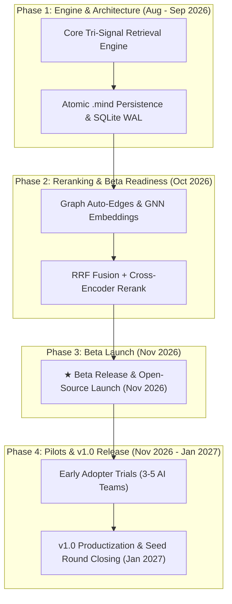

# HybridMind – Investor Proposal

**Executive Summary:** HybridMind is a novel AI memory system that goes beyond pure vector search by combining **semantic (embedding)**, **lexical (BM25)**, and **graph-based** retrieval in one portable database.  Today’s AI agents struggle to maintain long-term context across sessions, because large models alone can’t “remember” past interactions. HybridMind solves this by storing each memory as a vector, a searchable document, and a graph node, and by fusing all three signals. Our implementation (FastAPI + FAISS + BM25 + NetworkX + SQLite) runs entirely locally in a single `.mind` file.  Over the next 6 months we will finalize the core tri-signal engine, integrate cross-encoder reranking, and launch a beta for early adopters. We are seeking **$500K** in seed funding (12 months runway) to complete development, begin pilot deployments, and grow the team. 

## Problem & Opportunity  
LLM-based agents (chatbots, assistants, multi-agent planners) promise huge productivity gains, but **forgetfulness** has become a key bottleneck. When an agent runs for days or across tools, its original context can no longer fit in the model’s window.  Simple context windows or replaying chat history are unsustainable at scale (token costs explode with long histories). Hybrid search has emerged as the solution: industry sources note that combining keyword (BM25) and semantic (vector) retrieval with rank fusion significantly improves relevance in RAG pipelines. Major players are tackling “AI memory” – for example, Mem0, Zep, Supermemory and others have raised funding and built products in this space. The enterprise **agentic AI** market is forecast to grow ~10× by 2030, driving urgent demand for robust, persistent memory layers. In short, there is a $B-scale opportunity for a next-gen memory platform that is **scalable, multi-modal, and easy to deploy**. 

## Solution & Product  
HybridMind is **a local-native hybrid memory database** built for AI agents. Every memory entry is stored as: 

- **Dense vector:** FAISS inner-product index of an embedding  
- **Sparse index:** Okapi BM25 index (with NLTK stemming) of the raw text  
- **Graph node:** A NetworkX directed graph capturing relations between memories (e.g. causality, entity links)  

All data lives in an atomic `.mind` package (SQLite + FAISS + BM25 + graph + manifest) that you can copy, backup or version like any other database. This **tri-signal representation** ensures that queries can match on meaning *and* exact wording and structure. 

At query time, HybridMind performs three parallel searches (vector similarity, keyword match, graph proximity) and merges them via **Reciprocal Rank Fusion (RRF)**.  For example, RRF ranks a candidate by summing weighted reciprocal ranks from each method. We dynamically adjust weights based on query type (semantic vs. keyword vs. multi-hop).  Finally, the top-N RRF candidates are fed into a **cross-encoder reranker** (mixed-bread “mxbai-rerank-large-v2”) to refine final scores. This two-stage retrieval (fast RRF fusion + precise neural rerank) yields higher accuracy with lower latency than any single method.  

In sum, HybridMind’s core differentiators are: 

- **Tri-Signal Retrieval:** Combined dense-vector, BM25, and graph queries, instead of relying on one method.  
- **Portable `.mind` Format:** A single-file memory store (SQLite+FAISS+NetworkX) that requires no external cloud services.  
- **RRF + Neural Reranker:** Late fusion of signals followed by a pretrained cross-encoder for precise recall.  
- **Local Operation:** Designed for on-prem or embedded use (no mandatory remote API).  

Compared to other solutions, HybridMind uniquely bridges vector, keyword and graph search in one package. The table below summarizes how HybridMind differs from Mem0, Zep, and Supermemory:  

| Platform | Memory Representation | Portability & Storage | On-Prem / Local | Ranking Strategy | Primary Target Use-Case |
| :--- | :--- | :--- | :--- | :--- | :--- |
| **HybridMind** | **Dense Vector + BM25 + Graph** | **Portable `.mind` bundle** | **Fully Native (Local SQLite + FAISS)** | **Dynamic RRF + Cross-Encoder Rerank** | **Long-term agent memory & multi-hop reasoning** |
| **Mem0** | Vector + Keyword + Entity Graph | Docker / Cloud Managed | Self-Hostable | Multi-Signal (Vector + BM25) | Token-efficient agent memory (per-user context) |
| **Zep** | Temporal Knowledge Graph | Cloud Managed (BYOC) | Requires Neo4j Infra | Graph-Centric Traversal | Enterprise chatbot memory (temporal chat logs) |
| **Supermemory** | Knowledge Graph + Vector | Cloud & Self-Hosted | Docker (Open Source) | Hybrid Search + Custom Retriever | Cross-app "Second Brain" & context search |

*(Sources: HybridMind internal architecture benchmark; public vendor specifications.)*

## Technical Approach & Milestones  
Our roadmap for the next **6 months** focuses on finalizing features and demonstrating viability. Key phases and acceptance criteria are:

- **Aug–Sep 2026:** Finalize HybridMind v2.0 core tri-signal retrieval engine and atomic `.mind` persistence layer. Deliverable: robust working engine with baseline benchmarks.
- **Oct 2026:** Implement advanced graph features (auto-generated edges, GNN embeddings), fine-tune RRF weights, and integrate cross-encoder reranking.
- **Nov 2026:** Beta release & open-source launch! Deliverable: `pip`-installable package, documentation, and starter agent demos for early adopters.
- **Nov–Dec 2026:** Conduct early adopter trials with 3–5 partner AI teams, iterate on feedback, and polish developer dashboard/CLI tools.
- **Jan 2027:** Complete productization (v1.0 full release) and close seed funding round.

Each milestone has clear criteria: functionality (pass QA tests), performance targets (e.g. <300ms recall), and usability (integrations with LangChain or similar). We will track progress on these metrics. 

## Go-to-Market & Users  
Our target customers are **AI/ML teams** building agentic applications (chatbots, personal assistants, robotics, knowledge workers) who need persistent memory. Key verticals include: enterprise assistants (customer support bots, sales bots), personal AI apps (assistant, tutoring, healthcare bots), and R&D (labs building custom agents). Early adopters will likely be startups and labs already integrating agent frameworks (e.g. LangChain, AutoGen) who struggle with memory and context. 

We plan a “bottom-up” developer outreach: tutorials, open-source demos, and integration guides for popular agent frameworks.  Partnerships with AI platform providers or large customers in fintech/healthcare (who need secure, compliant memory) are also on our radar. For example, we have contacts at multi-agent platforms and could pilot HybridMind as the backend memory for a finance chatbot, demonstrating compliance (on-prem, encrypted memory). Marketing will focus on technical channels (conference talks, GitHub, AI newsletters).  

## Team & Key Hires  
I (Founder & AI Engineer) have deep experience building production AI systems (legal AI at Jhana, multi-agent platform at Lexana). I cover core ML/data systems engineering and architecture. We have web/DevOps support currently. To execute the plan, we will hire **three critical roles**: 

- **Senior Machine Learning Engineer:** Specializing in retrieval (vector, sparse, graph embeddings) and optimizing ranking pipelines.  
- **Full-Stack Developer:** To build UI/CLI tools, user-facing SDKs, and manage cloud deployment tooling.  
- **Growth/BD Lead:** A business development partner with contacts in enterprise AI to drive pilot opportunities and partnerships.  

These hires will complement our skills. We will remain lean: focusing funds on product development and early sales rather than large overhead. 

## Budget & Funding Ask  
We seek **$500,000** to fund 12 months of operation. A high-level budget allocation is detailed below:

| Category | Allocation ($) | Share (%) | Description / Scope |
| :--- | :--- | :--- | :--- |
| **Engineering Salaries** | $300,000 | 60.0% | ~2.5 FTE engineers over 12 months (ML + Full-Stack) |
| **ML Compute & GPUs** | $40,000 | 8.0% | Cloud GPU instances (RunPod TEI, vLLM, benchmark training) |
| **Cloud Infrastructure** | $30,000 | 6.0% | Hosting, CI/CD pipelines, dev/test environments |
| **Legal & Compliance** | $20,000 | 4.0% | Entity formation, IP/licensing, data security audit |
| **Travel & Outreach** | $20,000 | 4.0% | Developer conferences, meetups, customer pilot visits |
| **Contingency Buffer** | $30,000 | 6.0% | 10% operational buffer for unforeseen overruns |
| **Total Ask** | **$500,000** | **100.0%** | **12-Month Operating Runway** |

*Assumptions:* The ask assumes a standard seed valuation (TBD) and covers the first-year operating costs outlined above. We can adjust roles or spend if needed, but this outline ensures we hit key milestones in one year. 

## Risks & Mitigations  
1. **Technical risk:** Combining three retrieval systems is complex. *Mitigation:* We will iterate quickly on prototypes, benchmark extensively (using hybrid-RAG tasks), and leverage known algorithms (RRF). FastAPI & SQLite keep the core simple.  
2. **Market risk:** Will customers adopt another memory tool? *Mitigation:* We will target use cases where existing solutions fall short (e.g. multi-hop queries, privacy-sensitive data). Early adopter trials and open-source release will validate real demand.  
3. **Competitive risk:** Larger vendors (Mem0, Zep, Supermemory) are active. *Mitigation:* HybridMind’s on-prem capability and true vector+lexical+graph fusion with a single-file store is unique. We emphasize our lower latency (no cloud hops) and portability.  
4. **Team risk:** Small team can slow delivery. *Mitigation:* We plan targeted hires (above) as soon as funding closes, and we will outsource non-core tasks (e.g. bookkeeping).  
5. **Data/privacy risk:** Storing user memory raises compliance issues. *Mitigation:* All data can be stored encrypted, and since HybridMind is local, customers retain full data control.  We will implement access controls and secure coding practices from the start. 

## Ask & Next Steps  
We invite a $500K seed investment for a 12-month runway. In next steps, we will provide our full **pitch deck** (market analysis, vision), a **prototype demo**, and an **architecture diagram** (non-confidential). We would welcome the chance to present these materials and demo HybridMind in a follow-up meeting. Please let us know a convenient time to discuss further – we’re excited to partner and make AI agents more memory-capable.  

